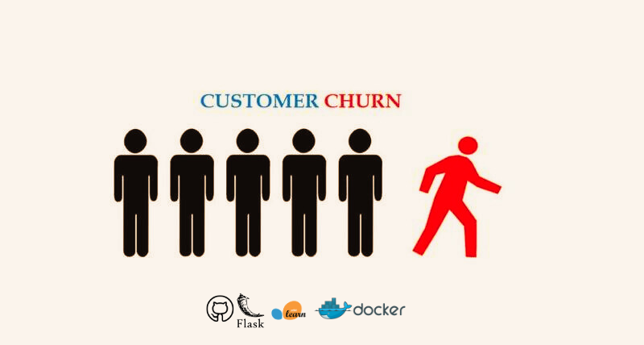
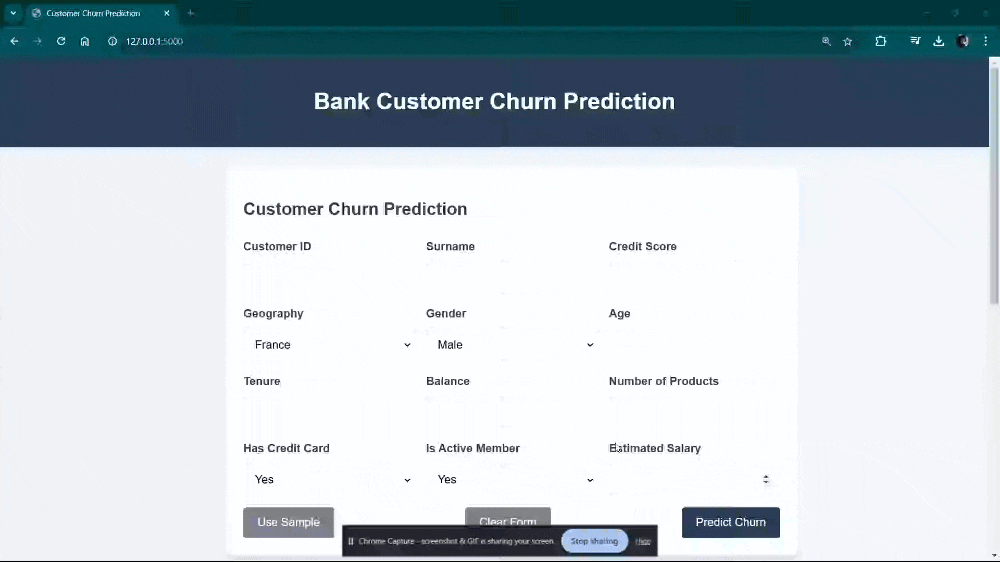
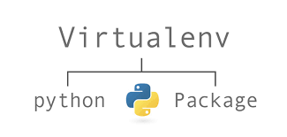

<p align="center">
    
</p>

# Bank Customer Churn Prediction App

## Table of Contents

1. [Overview](#overview)
2. [Project Highlights](#project-highlights)
3. [Data Analysis and Insights](#data-analysis-and-insights)
4. [Features](#features)
5. [Project Structure](#project-structure)
6. [Getting Started](#getting-started)
   - [Prerequisites](#prerequisites)
   - [Installation](#installation)
   - [Docker Deployment](#docker-deployment)
7. [Usage](#usage)
8. [Technical Components](#technical-components)
9. [Model Performance](#model-performance)
10. [Example Scenario](#example-scenario)
11. [Contributing](#contributing)
12. [License](#license)

## Overview

The **Bank Customer Churn Prediction App** is a comprehensive data science project designed to predict customer account closures (churn) using advanced machine learning techniques. This end-to-end solution transforms raw customer data into actionable insights, helping financial institutions proactively manage customer retention.

## Project Highlights

- 🤖 **Advanced ML Ensemble**: XGBoost, LightGBM, and CatBoost
- 📊 **High Prediction Accuracy**: AUC Score of 0.891
- 🌐 **Web Interface**: Flask-based predictive application
- 🐳 **Containerized Deployment**: Docker support
- 📈 **Comprehensive Data Analysis**: In-depth exploratory analysis

### Technologies Used

- **Language**: Python 3.11.5
- **Core Libraries**:
  - Pandas, NumPy
  - Scikit-learn
  - Matplotlib, Seaborn

#### Web & Deployment

- **Framework**: Flask
- **Containerization**: Docker

## Demonstration

<p align="center">
    
</p>

## Data Analysis and Insights

### Key Findings

- **Churn Rate**: 21% of customers in the dataset
- **Geographic Trends**:
  - Highest churn rate in Germany
- **Demographic Observations**:
  - Females showed higher churn propensity
- **Customer Activity**:
  - Non-active members more likely to churn

### Feature Engineering Highlights

- Created `Age-Tenure Ratio`
- Developed `Active Credit Card Status`
- Implemented targeted encoding strategies

### Visualization Insights

1. Zero-balance accounts have higher churn probability
2. Credit card ownership minimally impacts churn
3. Customers with 3-4 products exhibit increased churn risk

## Features

### Machine Learning

- **Ensemble Classifiers**:
  - XGBoost
  - LightGBM
  - CatBoost
- Advanced preprocessing techniques
- Hyperparameter optimization

### Web Application

- Intuitive user interface
- Real-time churn prediction
- Sample data auto-fill functionality

### Deployment

- Docker containerization
- Easy-to-use deployment

## Project Structure

```plaintext
.
├── README.md                   # Project documentation
├── app/                        # Flask application
│   ├── app.py                  # Main application entry point
│   ├── static/                 # Static web resources
│   │   └── styles.css          # Application styling
│   ├── templates/              # HTML templates
│   │   ├── base.html
│   │   ├── form.html
│   │   └── result.html
│   └── utils.py                # Utility functions
├── models/                     # Machine learning models
│   ├── train.py                # Model training script
│   ├── test.py                 # Model testing script
│   └── model.joblib            # Trained model
├── requirements.txt            # Python dependencies
└── dockerfile                  # Docker configuration
```

## Getting Started

### Prerequisites

- Python 3.10+
- Docker (optional)
- pip package manager

### Installation

<p align="left">
    
</p>

1. Clone the repository:

   ```bash
   git clone https://github.com/your-username/bank-churn-prediction.git
   cd bank-churn-prediction
   ```

2. Create virtual environment:

   ```bash
   python -m venv .venv
   source .venv/bin/activate  # Unix/macOS
   # or
   .venv\Scripts\activate     # Windows
   ```

3. Install dependencies:
   ```bash
   pip install -r requirements.txt
   ```

### Docker Deployment

<p align="left">
    
</p>

```bash
# Build Docker image
docker build -t churn-prediction-app .

# Run container
docker run -p 5000:5000 churn-prediction-app

# OR pull pre-built image
docker pull sayedgamal/churn-prediction-app:latest
docker run -d -p 5000:5000 sayedgamal/churn-prediction-app:latest
```

## Usage

### Web Application

1. Navigate to `http://localhost:5000`
2. Input customer details
3. Click "Predict" for churn probability

### Jupyter Notebook

Explore detailed analysis in `bank-customer-churn-prediction-0-891-auc-score.ipynb`

## Technical Components

- **Preprocessing**:
  - Target encoding
  - Feature scaling
  - Custom engineering pipelines
- **Model Training**:
  - Ensemble voting mechanism
  - Cross-validation
- **Deployment**:
  - Flask web framework
  - Docker containerization

## Model Performance

- **AUC Score**: 0.891
- **Algorithms**: XGBoost, LightGBM, CatBoost

## Example Scenario

| Feature       | Value   |
| ------------- | ------- |
| Age           | 45      |
| Credit Score  | 750     |
| Geography     | Germany |
| Gender        | Female  |
| Active Member | Yes     |

etc..

**Predicted Churn Probability**: 76%

## Contributing

Contributions are welcome!

Steps to contribute:

1. Fork the repository
2. Create your feature branch
3. Commit changes
4. Push to the branch
5. Create a pull request

---

**Developed with ❤️ by Sayed Gamal**
